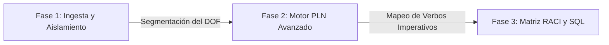

# 🛠️ STPS HUB V2.0: NOM-SMART AUDITOR
### Procesamiento del Lenguaje Natural (PLN) Aplicado al Compliance Industrial

Este repositorio aloja el core técnico del modelo **NOM-Smart Auditor**, un pipeline de ingeniería lingüística automatizado diseñado específicamente para mitigar riesgos regulatorios, optimizar tiempos operativos y prevenir multas de la STPS dentro de la cadena de suministro de la industria automotriz.

---

## 📊 Descripción del Proyecto
El motor está programado para realizar la ingesta, desambiguación semántica y mapeo estructurado de las normativas de la **Secretaría del Trabajo y Previsión Social (STPS)** publicadas en el **Diario Oficial de la Federación (DOF)**. El sistema se enfoca con precisión en las normas críticas del entorno de manufactura: 
*   **NOM-001-STPS** (Edificios, locales, instalaciones y áreas de centros de trabajo).
*   **NOM-017-STPS** (Equipo de protección personal - Selección, uso y manejo).
*   **NOM-019-STPS** (Constitución, organización y funcionamiento de las comisiones de seguridad e higiene).

El algoritmo transforma la densidad conceptual de los textos legales no estructurados en una **Matriz RACI automatizada, auditable y persistente**.

---

## ⚙️ Arquitectura del Pipeline y Flujo del Motor

El procesamiento de datos de este notebook se ejecuta de forma secuencial a través de tres capas operativas:

### 📥 Fase 1: Ingesta y Aislamiento
*   **Segmentación del DOF:** Algoritmo de fragmentación automatizada de normativas laborales mexicanas.
*   **Granularidad:** Aislamiento de **129 unidades mínimas de cumplimiento** normativo.

### 🧠 Fase 2: Motor PLN Avanzado
*   **Ingeniería Lingüística:** Análisis sintáctico profundo aplicado a la identificación de **verbos imperativos** y cláusulas absolutas de obligación.
*   **Métricas de Validación y Confianza:**
    *   **0.9661 Kappa** (Alto índice de concordancia interanotador).
    *   **99.28% Recall Legal** (Minimización estricta de falsos negativos para evitar omisiones regulatorias).
    *   **99.63% F1-Score** (Balance óptimo de precisión matemática general del modelo).

### 📊 Fase 3: Matriz RACI y Persistencia en SQL
*   **Entregable Operativo:** Generación automatizada de roles, responsabilidades y asignación de tareas auditables para la planta automotriz.
*   **Infraestructura de Datos:** Módulo de persistencia diseñado para permitir la **exportación directa a Bases de Datos Relacionales (SQL)**, garantizando la compatibilidad con el estándar industrial empresarial.

---

## 💼 Servicios de Consultoría Especializada
En paralelo con el despliegue del software, se ofrece acompañamiento profesional para la personalización y transferencia tecnológica en la Industria 4.0:
*   **Extracción automática de información (NER)** en documentación y contratos de proveedores.
*   **Minería de texto** y curaduría de corpus industriales.
*   **Estructuración técnica** y normalización terminológica de manuales de operación en planta.
*   **Optimización avanzada de prompts** y flujos lógicos con expresiones regulares (regex) en Python.
*   **Diseño y entrenamiento** de asistentes virtuales conversacionales basados en conocimiento normativo local.

---

## 👩‍💻 Desarrolladora y Contacto
*   **Nombre:** Nayeli Rodríguez Flores
*   **Perfil:** Analista en Tecnologías del Lenguaje e IA Aplicada | Licenciatura en Literatura Intercultural (Área de Tradición Clásica - UNAM).
*   **Contacto:** nayelirfali@gmail.com | +52 241 105 40 05
